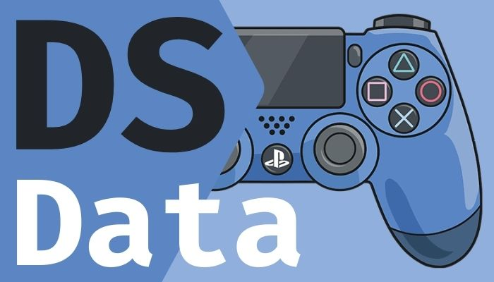

# DSData



> Leia e escreva dados com facilidade em seu dualshock 4.

## Sobre o projeto

DSData é uma biblioteca java simples, em desenvolvimento, feito para solucionar demandas de projetos que implementam controles DS4 e necessitam da leitura e escrita de informações.

De forma simples e direta, você pode ler o estado de botões e gatilhos, além de conseguir enviar comandos como vibrações e mudanças de cor de led.

### Recursos

- [x] Leitura de todos os botões, gatilhos e analógicos.
- [x] Envio de vibração e flashs. Além da troca da cor do led traseiro do controle.
- [x] Gerenciamento automático dos dispositivos que são pareados ou despareados do computador.

### Ajustes e melhorias

O projeto ainda está em desenvolvimento e próximas atualizações serão voltadas nos seguintes recursos:

- [ ] Bugs menores...

## ☕ Usando o DSData

Para utilizar o DSData, basta importar-lo em seu projeto e utilizar suas classes para ter acesso aos métodos de leitura e escrita de dados.

Em `./doc/index.html` você tem acesso ao JavaDoc com todo detalhamento da biblioteca.

### Exemplo

```java
DsManager manager = DsManager.getInstance();// Recupera uma instancia do DsManager

while (true) {
    if (!manager.getConnectedDevices().isEmpty()) // Espera ao menos um controle estar pareado com o computador
    {
        DsDevice controller = manager.getConnectedDevices().stream().findFirst().orElseThrow(); // Retorna o primeiro controle encontrado
        
        InputReport inputReport = controller.getInputReport(); // Recupera o relatorio de entrada do controle
        
        OutputReportFCR outputReport = controller.getOutputReport();// Recupera o relatorio de saída do controle
        
        if (inputReport.getCross()) // Leitura do botão X do controle
        {
            outputReport.setLed(255, 0, 0); // caso o X seja pressionado, altera a cor do led para vermelho
        } else {
            outputReport.setReset(); // se não, envia os valores padrões da biblioteca para o controle
        }
    }
    Thread.sleep(5);
}
```

## 🤝 Reconhecimentos aos colaboradores

* [Daniel Amaral](https://github.com/danamaral92)
* [Gabriel Trindade](https://github.com/GabrielTrindade31)

## 🙋🏾‍♂️ Autor

* [Igor Oliveira](https://github.com/reedbluue) - Just another person

## 📝 Licença

Esse projeto está sob licença. Veja o arquivo [LICENÇA](./LICENSE) para mais detalhes.